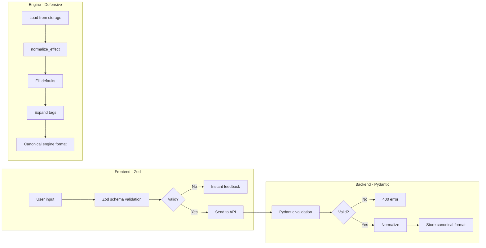
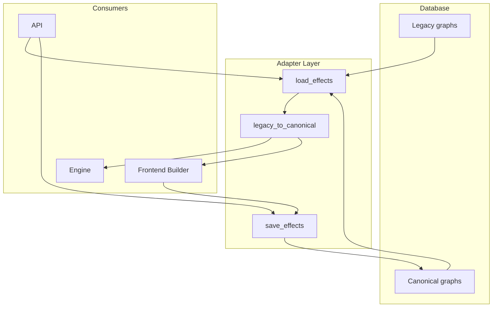

# Unified Effect System Refactoring Plan

> **Version 2.0** - Updated with enum-based classification, discriminated unions, and cleaner architecture

## Executive Summary

The current system uses **type-based tabs** (Triggered, Activated, Spell, Static, Continuous, Keywords) to create abilities. The proposed refactor unifies this into a **single effect-centric model** using orthogonal enums instead of boolean flags, discriminated union effect bodies, and an indexed active effects registry.

---

## Part 1: Current State Analysis

### Frontend Architecture (Current)

```
AbilityTabs.tsx
├── TriggeredAbilityForm.tsx    → Creates TRIGGER → CONDITION → EFFECT graph
├── ActivatedAbilityForm.tsx    → Creates ACTIVATED → EFFECT graph  
├── SpellAbilityForm.tsx        → Creates SPELL → EFFECT graph
├── StaticAbilityForm.tsx       → Creates EFFECT with abilityType="static"
├── ContinuousAbilityForm.tsx   → Creates EFFECT with abilityType="continuous"
└── KeywordAbilityForm.tsx      → Creates KEYWORD node
```

### Engine Processing (Current)

```
ability_graphs: List[Dict] on GameObject
├── TriggerRegistry         → Registers abilityType="triggered"
├── continuous_static.py    → Gathers abilityType="static"/"continuous"
├── rules.py               → Handles activated abilities + play_land
├── stack_resolver.py      → Resolves stack items
└── mana.py                → Special handling for lands
```

### Problems with Current Approach

1. **Boolean explosion**: 9+ `isX` flags create 512+ combinations, most invalid
2. **Mixed concerns**: Effect type, initiation, and persistence conflated
3. **Special-casing**: Keywords, lands, and static abilities all handled differently
4. **Fragile chaining**: `fromEffect: number` breaks on reorder
5. **No indexing**: Triggered/replacement effects require full list scans

---

## Part 2: New Data Model

### Core Enums (Orthogonal Dimensions)

```typescript
// How the effect is initiated
type Initiation = "static" | "triggered" | "activated";

// How it resolves
type Resolution = "stack" | "immediate";

// Does it create a lasting effect?
type Persistence = "instant" | "continuous";

// Semantic tags for special handling
type EffectTag =
  | "mana"
  | "land"
  | "replacement"
  | "prevention"
  | "cda"
  | "keyword"
  | "loyalty";

// Container-level classification (for spells vs permanents)
type SourceKind = "spell" | "permanent";
```

### Why Enums Beat Booleans

| Booleans (Old) | Enums (New) |
|----------------|-------------|
| `isContinuous && isStatic` - valid? | `persistence: "continuous"` - unambiguous |
| `isTriggered && isActivated` - invalid! | `initiation: "triggered"` - only one allowed |
| 9 flags = 512 combinations | 3 enums + tags = ~50 valid combinations |
| Validation = complex conditionals | Validation = type system |

### Effect Body as Discriminated Union

Instead of one blob that "sometimes implies continuous", make it explicit:

```typescript
type EffectBody =
  | OneShotEffect
  | ContinuousEffect
  | ReplacementEffect
  | PreventionEffect;

interface OneShotEffect {
  kind: "one_shot";
  action: OneShotAction;  // damage, draw, create_token, destroy, etc.
}

interface ContinuousEffect {
  kind: "continuous";
  layer: Layer;           // 1-7d per MTG rules
  modifier: ModifierSpec; // add_keyword, change_pt, set_types, etc.
  appliesTo: TargetSpec;
  duration: Duration;
}

interface ReplacementEffect {
  kind: "replacement";
  replaces: EventPattern;
  with: ReplacementOutcome;
}

interface PreventionEffect {
  kind: "prevention";
  prevents: EventPattern;
  amount?: DynamicValue;
}
```

### Duration as Structured Object

```typescript
type Duration =
  | { type: "while_in_zone"; zone: Zone }
  | { type: "until_end_of_turn" }
  | { type: "until_end_of_combat" }
  | { type: "until_your_next_turn" }
  | { type: "until_condition"; condition: Condition };
```

### Unified Effect Structure

```typescript
interface UnifiedEffect {
  id: string;                    // Stable ID for chaining
  
  // === Classification (enums, not booleans) ===
  initiation: Initiation;        // static | triggered | activated
  resolution: Resolution;        // stack | immediate
  persistence: Persistence;      // instant | continuous
  tags: EffectTag[];             // mana, land, replacement, etc.
  
  // === Conditional fields based on initiation ===
  trigger?: TriggerSpec;         // Required if initiation === "triggered"
  cost?: CostSpec;               // Required if initiation === "activated"
  
  // === Conditions (ability-level gate) ===
  conditions?: Condition[];
  
  // === The actual effect (discriminated union) ===
  effect: EffectBody;
}
```

### Effect Graph with Stable Chaining

```typescript
interface EffectGraph {
  id: string;
  sourceKind: SourceKind;        // "spell" | "permanent"
  
  steps: EffectStep[];           // Ordered effect steps
  
  // Modal configuration (if applicable)
  modal?: {
    count: number;               // How many modes to choose
    modes: ModalMode[];
  };
}

interface EffectStep {
  id: string;                    // Stable ID
  effect: UnifiedEffect;
  next?: string[];               // IDs of next steps (supports branching)
}
```

### Keywords as Effects (No Special Node Type)

"Flying" becomes:

```typescript
{
  id: "flying-effect",
  initiation: "static",
  resolution: "immediate",       // Static abilities don't use stack
  persistence: "continuous",
  tags: ["keyword"],
  effect: {
    kind: "continuous",
    layer: 6,                    // Layer 6: ability-adding
    modifier: { type: "add_keyword", keyword: "flying" },
    appliesTo: { type: "self" },
    duration: { type: "while_in_zone", zone: "battlefield" }
  }
}
```

"Creatures you control have flying" becomes:

```typescript
{
  id: "anthem-flying",
  initiation: "static",
  resolution: "immediate",
  persistence: "continuous",
  tags: ["keyword"],
  effect: {
    kind: "continuous",
    layer: 6,
    modifier: { type: "add_keyword", keyword: "flying" },
    appliesTo: { type: "creatures_you_control" },
    duration: { type: "while_in_zone", zone: "battlefield" }
  }
}
```

---

## Part 3: Land Handling

### What Changes

**Mana abilities** become unified activated abilities:

```typescript
// Forest's mana ability
{
  id: "forest-mana",
  initiation: "activated",
  resolution: "immediate",       // Mana abilities don't use stack
  persistence: "instant",
  tags: ["mana", "land"],
  cost: { items: [{ type: "tap_self" }] },
  effect: {
    kind: "one_shot",
    action: { type: "add_mana", manaType: "G", amount: 1 }
  }
}
```

### What Stays the Same

**`play_land` remains a special game action** (not an ability):

```python
# rules.py - KEEP THIS
def play_land(game_state: GameState, player_id: str, card_id: str) -> bool:
    """
    Playing a land is a special action with unique rules:
    - One per turn (unless modified by effects)
    - Only during main phase
    - Only when stack is empty
    - Only by active player with priority
    - Cannot be countered (it's not a spell)
    """
    # ... existing implementation
```

**Why keep it separate:**
- Playing a land is NOT activating an ability
- It has unique timing restrictions
- It cannot be countered
- Effects that "counter target spell or ability" don't stop land plays
- Cards like "Explore" add extra land plays, not extra ability activations

---

## Part 4: Engine Architecture

### Active Effect Registry (Indexed)

```python
@dataclass
class ActiveEffect:
    effect_id: str
    source_id: str
    controller_id: str
    effect_data: UnifiedEffect
    timestamp: int
    timestamp_order: int

class ActiveEffectRegistry:
    def __init__(self):
        # Primary storage
        self.effects: List[ActiveEffect] = []
        
        # Indexed lookups (O(1) instead of O(n))
        self._by_source: Dict[str, List[ActiveEffect]] = {}
        self._by_trigger_event: Dict[str, List[ActiveEffect]] = {}
        self._by_replacement_event: Dict[str, List[ActiveEffect]] = {}
        self._by_layer: Dict[int, List[ActiveEffect]] = {}
    
    def register(self, effect: ActiveEffect):
        self.effects.append(effect)
        self._by_source.setdefault(effect.source_id, []).append(effect)
        
        # Index by trigger event
        if effect.effect_data.initiation == "triggered":
            event = effect.effect_data.trigger.event
            self._by_trigger_event.setdefault(event, []).append(effect)
        
        # Index by replacement event
        if effect.effect_data.effect.kind == "replacement":
            event = effect.effect_data.effect.replaces.event_type
            self._by_replacement_event.setdefault(event, []).append(effect)
        
        # Index by layer (for continuous effects)
        if effect.effect_data.effect.kind == "continuous":
            layer = effect.effect_data.effect.layer
            self._by_layer.setdefault(layer, []).append(effect)
    
    def unregister_by_source(self, source_id: str):
        """Remove all effects when source leaves battlefield"""
        effects_to_remove = self._by_source.pop(source_id, [])
        for effect in effects_to_remove:
            self.effects.remove(effect)
            self._remove_from_indices(effect)
    
    def get_triggered_for_event(self, event: str) -> List[ActiveEffect]:
        """O(1) lookup for triggered abilities"""
        return self._by_trigger_event.get(event, [])
    
    def get_replacements_for_event(self, event: str) -> List[ActiveEffect]:
        """O(1) lookup for replacement effects"""
        return self._by_replacement_event.get(event, [])
    
    def get_continuous_for_layer(self, layer: int) -> List[ActiveEffect]:
        """O(1) lookup for layer application"""
        return self._by_layer.get(layer, [])
```

### Engine Flow Diagram

```mermaid
flowchart TD
    subgraph Registration [Effect Registration]
        A[Object enters battlefield] --> B[Parse ability_graphs]
        B --> C{For each effect}
        C --> D[Create ActiveEffect]
        D --> E[Register in ActiveEffectRegistry]
        E --> F[Index by event/layer/source]
    end
    
    subgraph Triggered [Triggered Ability Flow]
        G[Game event occurs] --> H["registry.get_triggered_for_event(event)"]
        H --> I{For each matching trigger}
        I --> J[Check scope/conditions]
        J --> K{Passes?}
        K -->|Yes| L[Queue to pending_triggers]
        K -->|No| I
        L --> M[Push to stack on priority]
        M --> N[Resolve: execute effect steps]
    end
    
    subgraph Continuous [Continuous Effect Flow]
        O[Layer application starts] --> P["registry.get_continuous_for_layer(layer)"]
        P --> Q[Sort by timestamp]
        Q --> R[Apply modifiers in order]
        R --> S{More layers?}
        S -->|Yes| O
        S -->|No| T[Final characteristics]
    end
    
    subgraph Cleanup [Effect Cleanup]
        U[Object leaves battlefield] --> V["registry.unregister_by_source(source_id)"]
        V --> W[Remove from all indices]
        W --> X[Effects stop applying]
    end
```



### Effect Resolution Engine

```python
class EffectResolver:
    def __init__(self, game_state: GameState, registry: ActiveEffectRegistry):
        self.game_state = game_state
        self.registry = registry
    
    def resolve_graph(self, graph: EffectGraph, context: ResolveContext):
        """Execute an effect graph's steps in order"""
        current_step_id = graph.steps[0].id if graph.steps else None
        results = {}
        
        while current_step_id:
            step = self._get_step(graph, current_step_id)
            result = self._resolve_effect(step.effect, context, results)
            results[step.id] = result
            
            # Determine next step (supports branching)
            current_step_id = self._get_next_step(step, result)
        
        return results
    
    def _resolve_effect(self, effect: UnifiedEffect, context: ResolveContext, 
                        previous_results: Dict) -> EffectResult:
        """Resolve a single effect based on its body kind"""
        body = effect.effect
        
        match body.kind:
            case "one_shot":
                return self._apply_one_shot(body.action, context)
            case "continuous":
                return self._register_continuous(effect, context)
            case "replacement":
                return self._register_replacement(effect, context)
            case "prevention":
                return self._register_prevention(effect, context)
    
    def _apply_one_shot(self, action: OneShotAction, context: ResolveContext):
        """Apply immediate effect (damage, draw, etc.)"""
        match action.type:
            case "damage":
                return self._deal_damage(action, context)
            case "draw":
                return self._draw_cards(action, context)
            case "create_token":
                return self._create_token(action, context)
            # ... etc
```

---

## Part 5: Validation Architecture

### Three-Layer Validation



### Validation Rules

```typescript
// Frontend validation (Zod)
const UnifiedEffectSchema = z.object({
  id: z.string().uuid(),
  initiation: z.enum(["static", "triggered", "activated"]),
  resolution: z.enum(["stack", "immediate"]),
  persistence: z.enum(["instant", "continuous"]),
  tags: z.array(EffectTagSchema),
  
  // Conditional validation
  trigger: TriggerSpecSchema.optional(),
  cost: CostSpecSchema.optional(),
  conditions: z.array(ConditionSchema).optional(),
  effect: EffectBodySchema,
}).refine(
  (data) => {
    // If triggered, must have trigger spec
    if (data.initiation === "triggered" && !data.trigger) {
      return false;
    }
    // If activated, must have cost spec
    if (data.initiation === "activated" && !data.cost) {
      return false;
    }
    // Mana abilities must resolve immediately
    if (data.tags.includes("mana") && data.resolution !== "immediate") {
      return false;
    }
    return true;
  },
  { message: "Invalid effect configuration" }
);
```

```python
# Backend normalization
def normalize_effect(effect: Dict) -> UnifiedEffect:
    """
    Normalize effect to canonical engine format:
    - Fill defaults
    - Convert legacy fields
    - Expand tags
    - Validate constraints
    """
    # Fill defaults
    effect.setdefault("resolution", "stack")
    effect.setdefault("persistence", "instant")
    effect.setdefault("tags", [])
    effect.setdefault("conditions", [])
    
    # Infer resolution from tags
    if "mana" in effect["tags"]:
        effect["resolution"] = "immediate"
    
    # Infer persistence from effect body
    if effect["effect"]["kind"] == "continuous":
        effect["persistence"] = "continuous"
    
    # Validate constraints
    _validate_effect_constraints(effect)
    
    return UnifiedEffect(**effect)
```

---

## Part 6: Frontend Architecture

### Intent-First Wizard Flow

**Step 1: Intent Selection** (single choice, not checkboxes)

```
┌─────────────────────────────────────────────┐
│ What kind of ability is this?               │
├─────────────────────────────────────────────┤
│ ○ Triggered ("When/Whenever/At...")         │
│ ○ Activated ("Pay cost to...")              │
│ ○ Always On (static/continuous)             │
│ ○ Spell Effect (when spell resolves)        │
│ ○ Replacement ("Instead of...")             │
│ ○ Prevention ("Prevent...")                 │
│ ○ Keyword (flying, trample, etc.)           │
└─────────────────────────────────────────────┘
```

**Step 2: Configuration** (based on intent)

For **Triggered**:
```
┌─────────────────────────────────────────────┐
│ When does this trigger?                     │
├─────────────────────────────────────────────┤
│ Event: [enters_battlefield ▼]               │
│ Scope: [self ▼]                             │
│ Filter: [creature ▼] (optional)             │
├─────────────────────────────────────────────┤
│ ▸ Advanced Options                          │
│   ☐ Resolves immediately (no stack)         │
└─────────────────────────────────────────────┘
```

For **Activated**:
```
┌─────────────────────────────────────────────┐
│ What is the activation cost?                │
├─────────────────────────────────────────────┤
│ + Add Cost Item                             │
│ ┌─────────────────────┐                     │
│ │ {T}: Tap this       │ [×]                 │
│ └─────────────────────┘                     │
├─────────────────────────────────────────────┤
│ ▸ Advanced Options                          │
│   ☐ Mana ability (resolves immediately)     │
│   Timing: ○ Any time  ○ Sorcery speed       │
└─────────────────────────────────────────────┘
```

For **Always On**:
```
┌─────────────────────────────────────────────┐
│ What does this modify?                      │
├─────────────────────────────────────────────┤
│ Applies to: [creatures_you_control ▼]       │
│ Modifier: [+1/+1 ▼]                         │
│                                             │
│ Duration: While this is on the battlefield  │
└─────────────────────────────────────────────┘
```

For **Keyword**:
```
┌─────────────────────────────────────────────┐
│ Select keyword                              │
├─────────────────────────────────────────────┤
│ [Flying ▼]                                  │
│                                             │
│ ▸ Applies to other permanents?              │
│   ☐ Yes → [creatures_you_control ▼]         │
└─────────────────────────────────────────────┘
```

**Step 3: Conditions** (optional, collapsed by default)

```
┌─────────────────────────────────────────────┐
│ ▸ Add Conditions (optional)                 │
├─────────────────────────────────────────────┤
│ + Add Condition                             │
│ ┌─────────────────────────────────────┐     │
│ │ You control ≥ 3 creatures           │ [×] │
│ └─────────────────────────────────────┘     │
└─────────────────────────────────────────────┘
```

**Step 4: Effect** (what actually happens)

```
┌─────────────────────────────────────────────┐
│ What happens?                               │
├─────────────────────────────────────────────┤
│ Effect type: [damage ▼]                     │
│ Amount: [3          ]                       │
│ Target: [target_creature ▼]                 │
│ ☐ Optional ("may")                          │
├─────────────────────────────────────────────┤
│ + Add another effect step                   │
└─────────────────────────────────────────────┘
```

### New Component Structure

```
frontend/features/builder/components/
├── EffectList.tsx              # Shows all effects on the card
├── AddEffectButton.tsx         # Single "Add Effect" button
├── EffectCard.tsx              # Display single effect summary
└── EffectWizard/
    ├── index.tsx               # Wizard container + state
    ├── IntentStep.tsx          # Step 1: Select intent
    ├── TriggerConfig.tsx       # Config for triggered
    ├── ActivatedConfig.tsx     # Config for activated
    ├── ContinuousConfig.tsx    # Config for always-on
    ├── ReplacementConfig.tsx   # Config for replacement
    ├── KeywordConfig.tsx       # Config for keywords
    ├── ConditionsStep.tsx      # Optional conditions
    ├── EffectBodyStep.tsx      # Define the actual effect
    └── ReviewStep.tsx          # Final review before save
```

### Store Structure

```typescript
// frontend/store/effectStore.ts
interface EffectStore {
  // Card-level
  cardId: string | null;
  sourceKind: SourceKind;        // "spell" | "permanent"
  
  // Effects
  effects: UnifiedEffect[];
  
  // Wizard state
  wizardOpen: boolean;
  wizardStep: number;
  editingEffectId: string | null;
  
  // Actions
  addEffect: (effect: UnifiedEffect) => void;
  updateEffect: (id: string, updates: Partial<UnifiedEffect>) => void;
  removeEffect: (id: string) => void;
  reorderEffects: (fromIndex: number, toIndex: number) => void;
  
  // Wizard actions
  openWizard: (editId?: string) => void;
  closeWizard: () => void;
  nextStep: () => void;
  prevStep: () => void;
  
  // Conversion
  toEffectGraph: () => EffectGraph;
  fromEffectGraph: (graph: EffectGraph) => void;
}
```

---

## Part 7: Migration Strategy

### Adapter Layer Architecture



### Migration Functions

```python
def load_effects(card_id: str) -> EffectGraph:
    """Load effects, converting legacy format if needed"""
    # Try canonical format first
    canonical = get_canonical_graph(card_id)
    if canonical:
        return canonical
    
    # Fall back to legacy and convert
    legacy = get_legacy_graph(card_id)
    if legacy:
        return legacy_to_canonical(legacy)
    
    return None

def legacy_to_canonical(legacy: Dict) -> EffectGraph:
    """Convert legacy ability graph to canonical format"""
    effects = []
    
    for node in legacy.get("nodes", []):
        if node["type"] == "EFFECT":
            effect = convert_legacy_effect(node, legacy)
            effects.append(effect)
        elif node["type"] == "KEYWORD":
            effect = convert_keyword_to_effect(node)
            effects.append(effect)
    
    # Determine source kind from legacy ability type
    source_kind = "spell" if legacy.get("abilityType") == "spell" else "permanent"
    
    return EffectGraph(
        id=legacy.get("abilityId", str(uuid4())),
        sourceKind=source_kind,
        steps=[EffectStep(id=e.id, effect=e) for e in effects]
    )

def convert_legacy_effect(node: Dict, graph: Dict) -> UnifiedEffect:
    """Convert a legacy EFFECT node to UnifiedEffect"""
    data = node.get("data", {})
    ability_type = graph.get("abilityType", "spell")
    
    # Determine initiation
    if ability_type == "triggered":
        initiation = "triggered"
    elif ability_type == "activated":
        initiation = "activated"
    elif ability_type in ("static", "continuous"):
        initiation = "static"
    else:
        initiation = "static"  # Default for spell effects on permanents
    
    # Determine resolution
    uses_stack = graph.get("usesStack", True)
    resolution = "immediate" if not uses_stack else "stack"
    
    # Determine persistence from effect type
    continuous_types = {"gain_keyword", "change_power_toughness", "set_types", 
                        "add_type", "set_colors", "change_control", "cda_power_toughness"}
    persistence = "continuous" if data.get("type") in continuous_types else "instant"
    
    # Build tags
    tags = []
    if data.get("type") == "mana":
        tags.append("mana")
    if "cda" in data.get("type", ""):
        tags.append("cda")
    if data.get("type", "").startswith("replace_"):
        tags.append("replacement")
    
    # Convert effect body
    effect_body = convert_effect_body(data)
    
    # Extract trigger if present
    trigger = None
    if initiation == "triggered":
        trigger_node = find_trigger_node(graph)
        if trigger_node:
            trigger = convert_trigger(trigger_node)
    
    # Extract cost if present
    cost = None
    if initiation == "activated":
        activated_node = find_activated_node(graph)
        if activated_node:
            cost = convert_cost(activated_node)
    
    return UnifiedEffect(
        id=node.get("id", str(uuid4())),
        initiation=initiation,
        resolution=resolution,
        persistence=persistence,
        tags=tags,
        trigger=trigger,
        cost=cost,
        effect=effect_body
    )
```

---

## Part 8: File Changes Summary

### Files to Create

```
# Frontend - Types
frontend/lib/unifiedEffect.ts           # Type definitions
frontend/lib/effectValidation.ts        # Zod schemas

# Frontend - Store
frontend/store/effectStore.ts           # Zustand store

# Frontend - Components
frontend/features/builder/components/EffectList.tsx
frontend/features/builder/components/AddEffectButton.tsx
frontend/features/builder/components/EffectCard.tsx
frontend/features/builder/components/EffectWizard/index.tsx
frontend/features/builder/components/EffectWizard/IntentStep.tsx
frontend/features/builder/components/EffectWizard/TriggerConfig.tsx
frontend/features/builder/components/EffectWizard/ActivatedConfig.tsx
frontend/features/builder/components/EffectWizard/ContinuousConfig.tsx
frontend/features/builder/components/EffectWizard/ReplacementConfig.tsx
frontend/features/builder/components/EffectWizard/KeywordConfig.tsx
frontend/features/builder/components/EffectWizard/ConditionsStep.tsx
frontend/features/builder/components/EffectWizard/EffectBodyStep.tsx
frontend/features/builder/components/EffectWizard/ReviewStep.tsx

# Backend - Schemas
src/api/schemas/unified_effect_schemas.py

# Engine - Core
src/engine/effects/active_effects.py    # ActiveEffect + ActiveEffectRegistry
src/engine/effects/effect_resolver.py   # Unified effect resolution
src/engine/effects/migration.py         # Legacy conversion

# API
src/api/routes/effects.py               # New unified endpoints
```

### Files to Modify

```
# Frontend
frontend/store/builderStore.ts          # Integrate with effectStore
frontend/features/builder/page.tsx      # Use new components

# Engine
src/engine/state.py                     # Add active_effect_registry
src/engine/triggers/trigger_handler.py  # Use registry.get_triggered_for_event()
src/engine/continuous_static.py         # Use registry.get_continuous_for_layer()
src/engine/continuous_apply.py          # Use registry for layer application

# API
src/api/routes/abilities.py             # Add migration endpoint
```

### Files to Remove (After Migration)

```
frontend/features/builder/components/AbilityTabs.tsx
frontend/features/builder/components/forms/TriggeredAbilityForm.tsx
frontend/features/builder/components/forms/ActivatedAbilityForm.tsx
frontend/features/builder/components/forms/SpellAbilityForm.tsx
frontend/features/builder/components/forms/StaticAbilityForm.tsx
frontend/features/builder/components/forms/ContinuousAbilityForm.tsx
frontend/features/builder/components/forms/KeywordAbilityForm.tsx
```

---

## Part 9: Implementation Phases

### Phase 1: Backend Foundation

1. Create `unified_effect_schemas.py` with Pydantic models
2. Create `active_effects.py` with `ActiveEffect` and `ActiveEffectRegistry`
3. Add `active_effect_registry` to `GameState`
4. Create `migration.py` with `legacy_to_canonical()`
5. Add `/api/effects/` routes

**Deliverables:**
- [ ] `UnifiedEffect` Pydantic model
- [ ] `EffectGraph` Pydantic model
- [ ] `ActiveEffectRegistry` class with indexed lookups
- [ ] `normalize_effect()` function
- [ ] `legacy_to_canonical()` conversion
- [ ] API endpoints: validate, save, load, migrate

### Phase 2: Engine Integration

6. Update `trigger_handler.py` to use `registry.get_triggered_for_event()`
7. Update `continuous_static.py` to use `registry.get_continuous_for_layer()`
8. Update zone transitions to register/unregister effects
9. Create `effect_resolver.py` for unified resolution
10. Test with existing cards

**Deliverables:**
- [ ] Triggers use indexed registry lookup
- [ ] Continuous effects use indexed registry lookup
- [ ] Effects registered on battlefield enter
- [ ] Effects unregistered on battlefield leave
- [ ] All existing cards still work

### Phase 3: Frontend Rebuild

11. Create `unifiedEffect.ts` types
12. Create `effectValidation.ts` Zod schemas
13. Create `effectStore.ts`
14. Build `EffectWizard` components
15. Build `EffectList` and `EffectCard`
16. Integrate into builder page

**Deliverables:**
- [ ] Intent-first wizard flow
- [ ] All effect types configurable
- [ ] Keywords as effects
- [ ] Zod validation with instant feedback
- [ ] Store with toEffectGraph/fromEffectGraph

### Phase 4: Migration & Cleanup

17. Run migration on existing card graphs
18. Verify all cards work with canonical format
19. Remove legacy components
20. Update documentation

**Deliverables:**
- [ ] All existing graphs migrated
- [ ] Legacy components removed
- [ ] Tests passing
- [ ] Documentation updated

---

## Appendix A: Effect Classification Reference

| Intent | Initiation | Resolution | Persistence | Tags | Example |
|--------|------------|------------|-------------|------|---------|
| ETB trigger | triggered | stack | instant | - | "When ~ enters, draw a card" |
| Mana ability | activated | immediate | instant | mana, land | "{T}: Add {G}" |
| Activated damage | activated | stack | instant | - | "{2}{R}: Deal 2 damage" |
| Static keyword | static | immediate | continuous | keyword | "Flying" |
| Anthem | static | immediate | continuous | - | "Creatures you control get +1/+1" |
| CDA | static | immediate | continuous | cda | "~'s power is equal to..." |
| Replacement | static | immediate | instant | replacement | "If ~ would die, exile it instead" |
| Prevention | static | immediate | instant | prevention | "Prevent all damage to creatures" |

---

## Appendix B: Layer Reference

| Layer | What it modifies | Examples |
|-------|------------------|----------|
| 1 | Copy effects | Clone, Vesuvan Doppelganger |
| 2 | Control | Mind Control, Bribery |
| 3 | Text | Sleight of Mind (rarely used) |
| 4 | Types | Blood Moon, Prismatic Omen |
| 5 | Colors | Painter's Servant |
| 6 | Abilities | Giving/removing keywords |
| 7a | CDA P/T | Tarmogoyf |
| 7b | Set P/T | Humility, Turn to Frog |
| 7c | Modify P/T | Giant Growth, +1/+1 counters |
| 7d | P/T switching | Inside Out |

---

## Appendix C: Example Conversions

### Lightning Bolt (Spell)

```typescript
{
  id: "lightning-bolt-graph",
  sourceKind: "spell",
  steps: [{
    id: "damage-step",
    effect: {
      id: "bolt-damage",
      initiation: "static",      // Spell effects are "static" in the sense they just happen
      resolution: "stack",       // Spells use the stack
      persistence: "instant",
      tags: [],
      effect: {
        kind: "one_shot",
        action: {
          type: "damage",
          amount: 3,
          target: { type: "any_target" }
        }
      }
    }
  }]
}
```

### Llanowar Elves (Creature with Mana Ability)

```typescript
{
  id: "llanowar-graph",
  sourceKind: "permanent",
  steps: [{
    id: "mana-step",
    effect: {
      id: "llanowar-mana",
      initiation: "activated",
      resolution: "immediate",
      persistence: "instant",
      tags: ["mana"],
      cost: { items: [{ type: "tap_self" }] },
      effect: {
        kind: "one_shot",
        action: { type: "add_mana", manaType: "G", amount: 1 }
      }
    }
  }]
}
```

### Glorious Anthem (Static Continuous)

```typescript
{
  id: "anthem-graph",
  sourceKind: "permanent",
  steps: [{
    id: "anthem-step",
    effect: {
      id: "anthem-buff",
      initiation: "static",
      resolution: "immediate",
      persistence: "continuous",
      tags: [],
      effect: {
        kind: "continuous",
        layer: 7,  // 7c: modify P/T
        modifier: { type: "modify_pt", power: 1, toughness: 1 },
        appliesTo: { type: "creatures_you_control" },
        duration: { type: "while_in_zone", zone: "battlefield" }
      }
    }
  }]
}
```

### Ravenous Chupacabra (ETB Trigger)

```typescript
{
  id: "chupacabra-graph",
  sourceKind: "permanent",
  steps: [{
    id: "etb-step",
    effect: {
      id: "chupacabra-etb",
      initiation: "triggered",
      resolution: "stack",
      persistence: "instant",
      tags: [],
      trigger: {
        event: "enters_battlefield",
        scope: "self"
      },
      effect: {
        kind: "one_shot",
        action: {
          type: "destroy",
          target: { type: "target_creature", filter: "opponent_controls" }
        }
      }
    }
  }]
}
```

---

*Last Updated: January 24, 2026 - Version 2.0*
